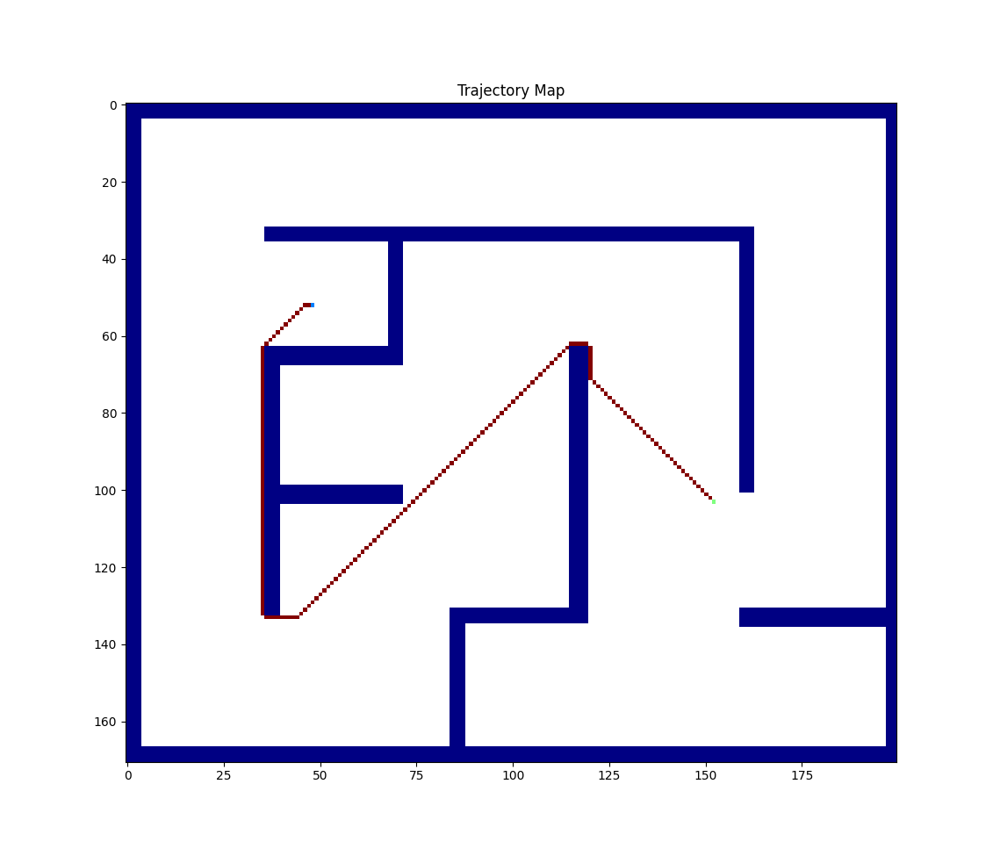

# Maze Solving Algorith


## Overview

Project that aim to find the optimal trajectory towards the goal in a finite 2D environment that is closed by obstacles, that's done by wavefront algorithm.

<p align="center" width="100%"></p>

### Args

``` cmd
python main.py [.mat file path] [variable name]
```

### Input

``` terminal
Please, Enter X coord. for start: 100
Please, Enter Y coord. for start: 100
```

### Output

``` terminal
value_map = 
[[1. 1. 1. ... 1. 1. 1.]
 [1. 1. 1. ... 1. 1. 1.]
 [1. 1. 1. ... 1. 1. 1.]
 ...
 [1. 1. 1. ... 1. 1. 1.]
 [1. 1. 1. ... 1. 1. 1.]
 [1. 1. 1. ... 1. 1. 1.]]
trajectory =
100 100
99 100
98 100
97 100
......
......
......
100 149
101 150
102 151
103 152
Time taken: 6.2487 secs
```

## Dependencies

``` txt
scipy
numpy
matplotlib
time
```

## Wavefront Algorithm

Given the start point and the goal point, the algorithm is implemented as follows:

1. The goal point is initialized with 2
2. The neighboring cells to the goal that are not obstacles are assigned the value of the goal point + 1
3. Update the goal value, that is, goal = goal + 1 then repeat steps 1 & 2 until all the spaces are filled.
4. The trajectory (shortest distance to the goal) is easily found by taking differences with all neighboring cells, that is, the minimum of the neighboring cells.

## Preview

<p align="center" width="100%"></p>


